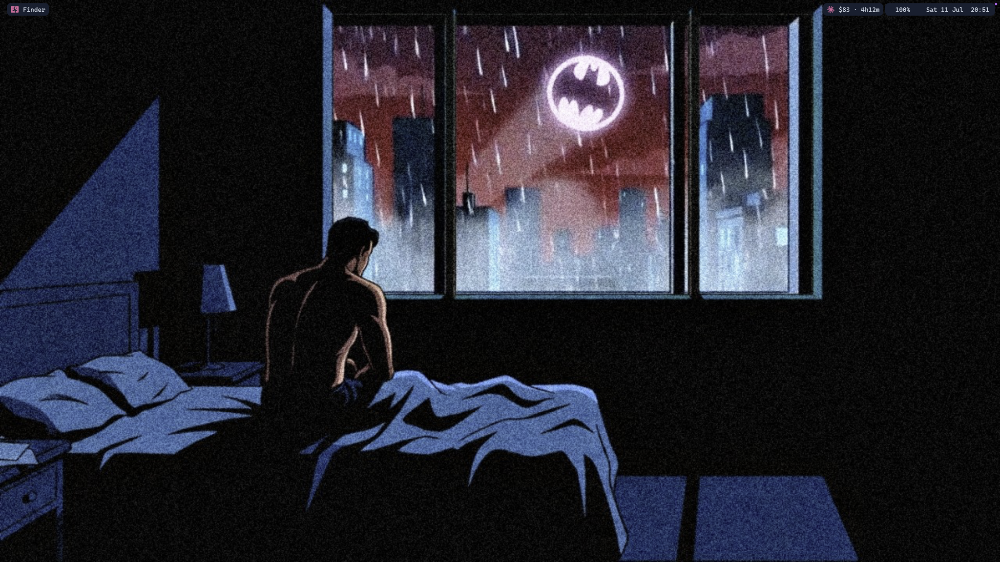
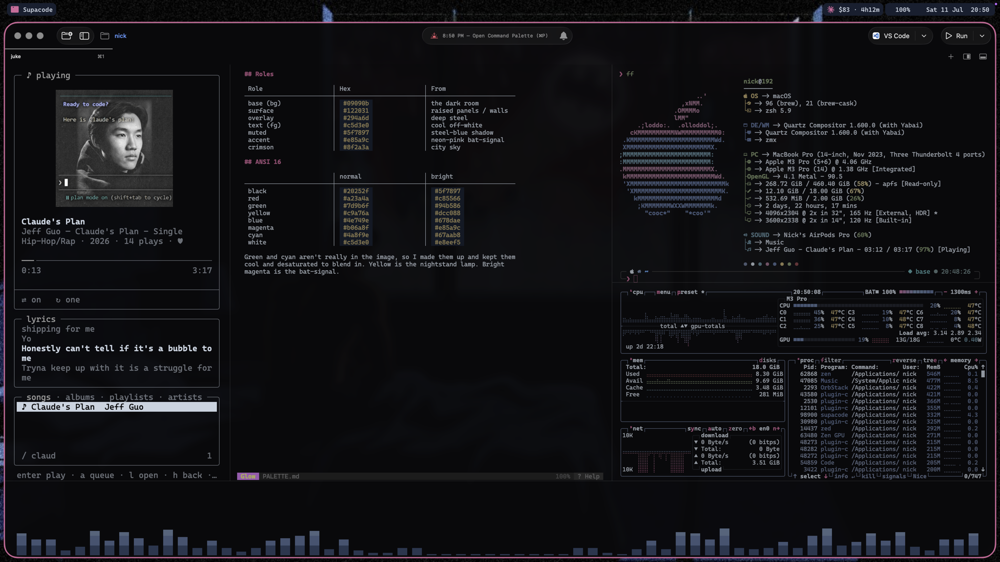
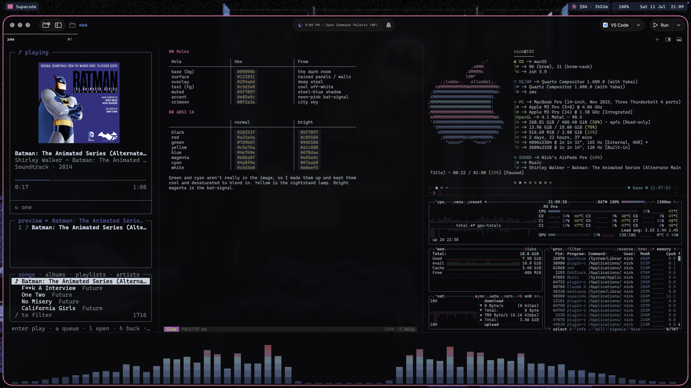
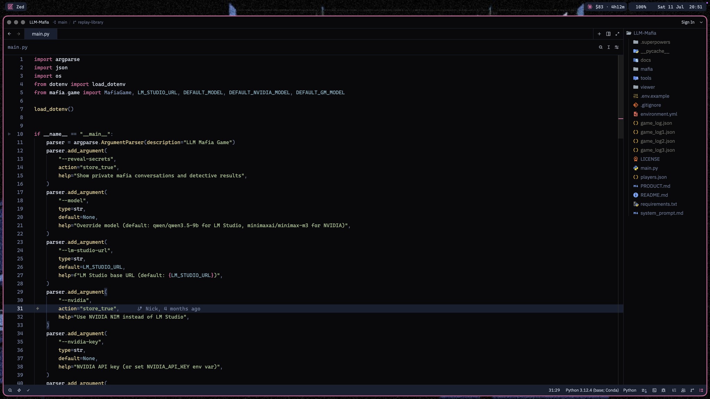
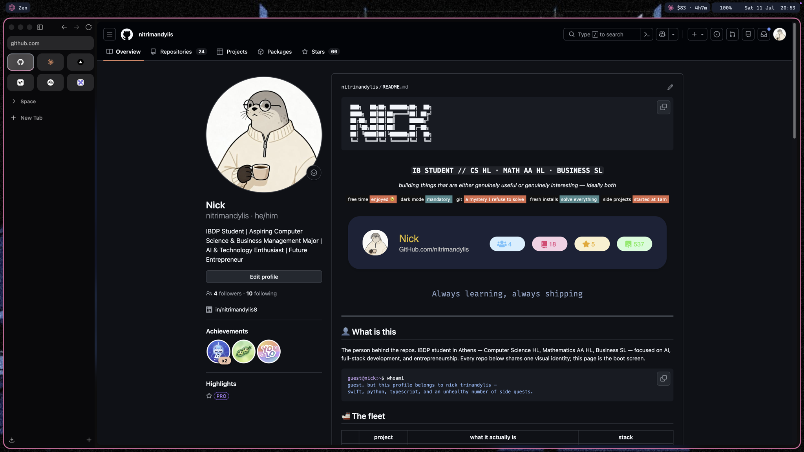
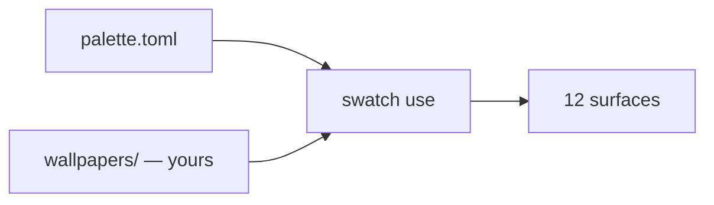

```
 ███████╗██╗    ██╗ █████╗ ████████╗ ██████╗██╗  ██╗
 ██╔════╝██║    ██║██╔══██╗╚══██╔══╝██╔════╝██║  ██║
 ███████╗██║ █╗ ██║███████║   ██║   ██║     ███████║
 ╚════██║██║███╗██║██╔══██║   ██║   ██║     ██╔══██║
 ███████║╚███╔███╔╝██║  ██║   ██║   ╚██████╗██║  ██║
 ╚══════╝ ╚══╝╚══╝ ╚═╝  ╚═╝   ╚═╝    ╚═════╝╚═╝  ╚═╝
 ████████╗██╗  ██╗███████╗███╗   ███╗███████╗███████╗
 ╚══██╔══╝██║  ██║██╔════╝████╗ ████║██╔════╝██╔════╝
    ██║   ███████║█████╗  ██╔████╔██║█████╗  ███████╗
    ██║   ██╔══██║██╔══╝  ██║╚██╔╝██║██╔══╝  ╚════██║
    ██║   ██║  ██║███████╗██║ ╚═╝ ██║███████╗███████║
    ╚═╝   ╚═╝  ╚═╝╚══════╝╚═╝     ╚═╝╚══════╝╚══════╝
```

<div align="center">

### `SIX PALETTES // TWELVE SURFACES // ZERO WALLPAPERS`

*colour documents for [swatch](https://github.com/nitrimandylis/swatch). bring your own pictures.*


-e85a9c?style=flat-square&labelColor=111111)


</div>

---

## 🎨 What is this

Six palettes for [swatch](https://github.com/nitrimandylis/swatch), the CLI that paints twelve macOS surfaces from one `palette.toml`. swatch ships as the engine alone — no themes — because a theme is taste and taste is personal data. This is my taste, split out so it can be cloned or ignored.

Three of them are published schemes typed from spec: Catppuccin Mocha, Nord, Tokyo Night. Sampling those from a wallpaper gets `base` right and drifts on everything after it, and a scheme with a spec should match every other terminal running it. The other three — Batman Jazz, Firewatch, McLaren — were pulled off images and then argued with by hand.

No wallpapers are in here. The pictures that produced these colours belong to Olly Moss, DC, McLaren and a handful of artists on the internet, and none of them licensed them to me for redistribution. Each theme is the colour document; the picture is your problem.

```console
nick@swatch-themes:~$ swatch list
batman-jazz      Batman Jazz (dark) — Near-black room, steel-blue midtones, a neon-pink bat-signal accent.
catppuccin       Catppuccin Mocha (dark) — soft pastels on a warm charcoal.
firewatch        Firewatch (dark) — Navy night over a magenta treeline, tower window burning amber.
mclaren          McLaren (dark) — Carbon black under pit lane light, cut by papaya orange.
nord             Nord (dark) — arctic and low-contrast on purpose.
tokyo-night      Tokyo Night (dark) — a blue city at 3am seen through glass.
[i] no wallpapers in this theme — add one: swatch add nord <image>
```

## 🌈 The palettes

| | theme | what it actually is |
|---|---|---|
| 01 | **batman-jazz** | near-black room, steel-blue midtones, one neon-pink bat-signal for accent. sampled, then argued with |
| 02 | **catppuccin** | mocha, typed from the published spec. deep is latte's mauve, the only darker sibling the scheme ships |
| 03 | **firewatch** | navy over a magenta treeline, tower window burning amber. the highest-contrast one here |
| 04 | **mclaren** | carbon black under pit lane light, cut by papaya `#ff5b02`. reads as a warning label at 3am |
| 05 | **nord** | the published arctic palette, low-contrast on purpose. do not "fix" the contrast |
| 06 | **tokyo-night** | night, not storm. blue `#7aa2f7` is the signature and everything defers to it |

Every palette is 8 roles + the full ANSI 16 + named extras + `on_fill` + `variant`. Nothing derived by formula, so nothing surprises you three surfaces later.

## 🚀 Run it

Needs [swatch](https://github.com/nitrimandylis/swatch) installed. Themes live wherever `SWATCH_THEMES` points, defaulting to `~/.config/swatch/themes`:

```bash
git clone https://github.com/nitrimandylis/swatch-themes.git ~/.config/swatch/themes
swatch add nord ~/Pictures/some-arctic-thing.png
swatch use nord
```

The `add` step isn't optional — `swatch use` refuses a theme with an empty wallpaper pool, and every pool in here is empty. Drop in more than one picture and `use` opens an fzf menu with previews.

## 📸 Evidence

Batman Jazz, applied. The others are shot when I get around to it.



<details>
<summary>more</summary>



juke, glow and btop sharing one palette.







zen's chrome comes from its CSS variables, not from painting its elements.

</details>

## 🔩 Under the hood



| file | job |
|---|---|
| `<theme>/palette.toml` | the whole theme. roles, ANSI 16, extras, opacity |
| `<theme>/wallpapers/` | gitignored. yours to fill, one palette to many pictures |
| `<theme>/README.md` | gitignored. `swatch use` generates it and it links to wallpapers that aren't here |
| `screenshots/` | proof the colours survive contact with real apps |

**Stack:** TOML · [swatch](https://github.com/nitrimandylis/swatch) · other people's colour specs

---

<div align="center">

**[Nick Trimandylis](https://github.com/nitrimandylis)**

`TASTE IS NOT A DEPENDENCY`

MIT licensed. The palettes are mine to give; the wallpapers never were.

</div>
